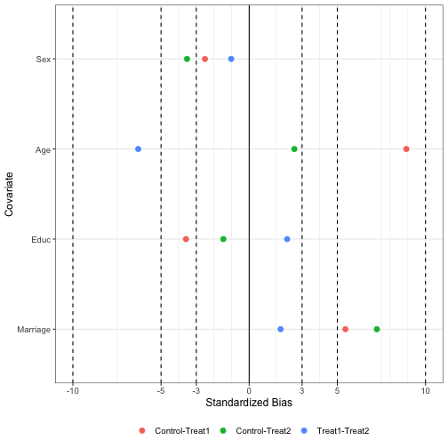
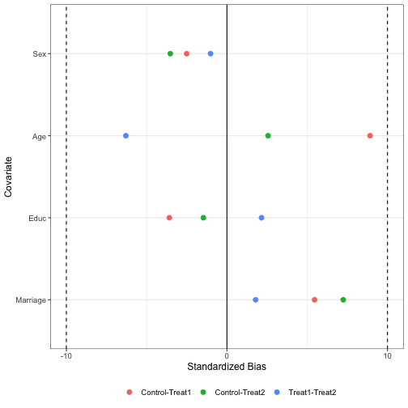
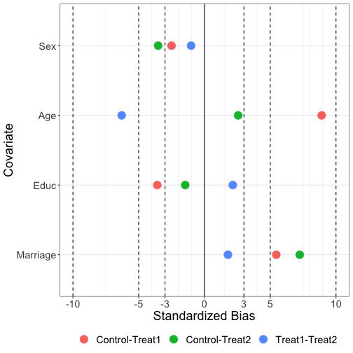
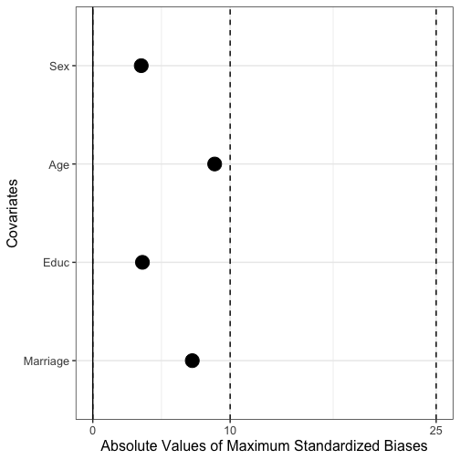
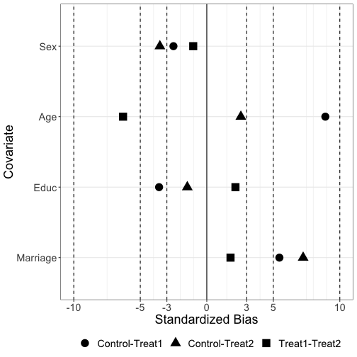
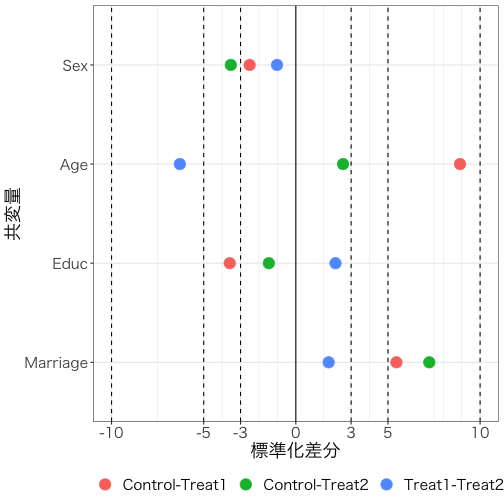
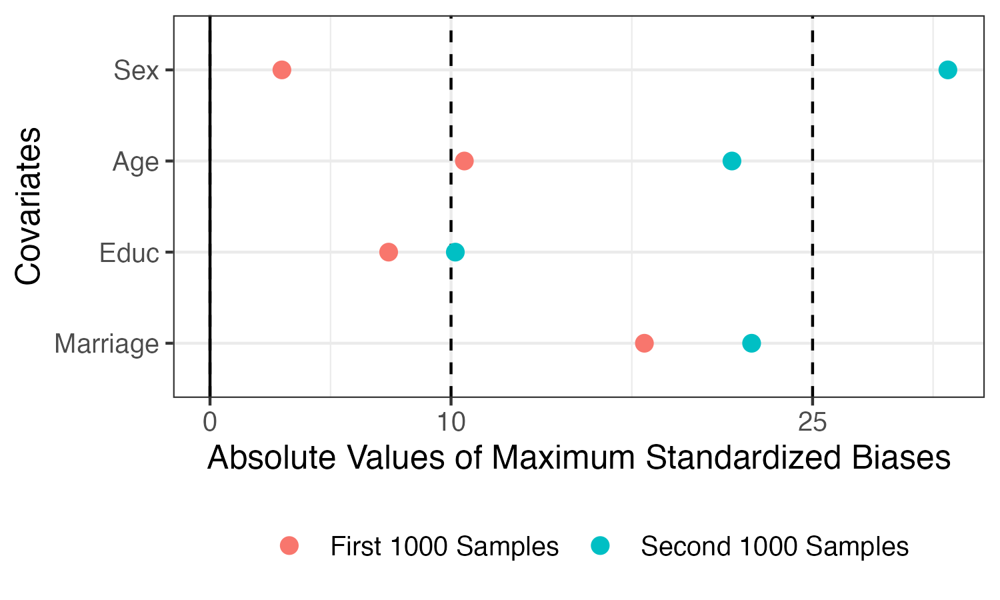

# BalanceR 0.8.0

R package for balance checking using standardized biases.

[](https://CRAN.R-project.org/package=BalanceR)

Author/Maintainer: Jaehyun Song (<https://www.jaysong.net> / <tintstyle@gmail.com>)

---

**更新履歴**

* 2023年3月3日: `plot()`関数で2つの`BalanceR`オブジェクトを一つのプロットにまとめるようになりました。`compare`引数にもう一つの`BalanceR`オブジェクト名を指定してください。
* 2022年7月18日: [秦正樹](http://hatam.sakura.ne.jp/)先生から頂きましたご意見を反映し、二値変数の制約を緩めました。これまで二値変数の場合、0と1のみで構成される必要がありましたが、このような制約がなくなりました。具体的には値が2つのみで構成されている場合、小さい方を0、大きい方を1にリコーディングした上でバランスを計算します。
* 2020年12月7日: グループが2つの場合、`summary()`メソッドおよび`simplify`引数が使えないバグを修正しました。
* 2020年12月2日: グループ数が多い場合、記述統計がずれる現象を修正しました。
* 2020年12月1日: `summary()`メソッドの追加
* 2020年11月30日: `print()`と`plot()`メソッドに`abs`と`simplify`引数を追加しました。
* 2020年8月1日
  * tidyselect形式で共変量指定 (`cov`)が可能になりました。
  * ~~パッケージ読み込みの際、{magrittr}パッケージが自動的に読み込まれるようになりました。~~
* 2020年3月5日: `group`と`cov`引数を入力する際、`"`を付ける必要がなくなりました。
  * これまでの通り、`"`を付けても構いません。
* 2020年2月22日: 共変量名を指定することが出来るように修正しました。
* 2019年6月15日
  1. グループ変数名が`"group"`の場合に`BalanceR()`関数が動かない問題を修正しました。[善教将大](https://zkun.sakura.ne.jp)先生からエラーレポーティングを頂きました。
  2. 欠損値が含まれる場合、記述統計量が`NA`と表示される問題を修正しました。[善教将大](https://zkun.sakura.ne.jp)先生からエラーレポーティングを頂きました。
* 2019年5月31日
  1. 実験群が2つの場合、`print()`関数の列名が正しく表示されない問題を修正しました。
  2. `tibble`オブジェクトで動かなかった問題を修正しました。
* 2019年5月8日: `plot()`関数に`color =`引数を追加しました。デフォルトは`TRUE`ですが、`FALSE`に設定すると白黒に表示されます。[善教将大](https://zkun.sakura.ne.jp)先生からご意見いただきました。

---

# Standardized Biasについて

実験群として統制群 (Control)と処置群 (Treat)がある場合、共変量Xの標準化差分は以下のように計算できます。

<center></center>

Xバーは平均値、s二乗は分散を意味します。ちなみにダミー変数の場合、以下のようになります。({BalanceR}では変数が0/1のみで構成されている場合、この式で標準化差分を計算します。)

<center></center>

分野によって基準は変わりうると思いますが、標準化差分の絶対値が3, 5, 10, 25未満ならバランスが取れていると判断します。社会科学では見る例だと10か25が多いような気がします。

---

# インストール

```r
devtools::install_github("JaehyunSong/BalanceR")
# または
remotes::install_github("JaehyunSong/BalanceR")
```

---

# 使い方

## バランスチェック

* **空白や特殊文字が含まれている変数名に対応しておりません**。したがって、\`Variable 1\`や\`Variable-2\`のような書き方は使えません。予め変数名の空白や特殊文字（一般的に変数名・オブジェクト名としては使えない文字）を除去してください。変数名は英数字と`.`、`_`のみで構成することを推奨します。

**Input**
```r
# パッケージの読み込み
library(BalanceR)

# ダミーデータの読み込み
data(BlcDF)

# 回答者の性別 (Sex)、年齢 (Age)、教育水準 (Educ)、結婚有無 (Marriae)のバランスチェック
# 実験群を示す変数はGroup
BlcChk <- BalanceR(data = BlcDF, group = Group,
                   cov  = c(Sex, Age, Educ, Marriage))

print(BlcChk, digits = 3)
```

**Output**

```
  Covariate Mean:Control SD:Control Mean:Treat1 SD:Treat1 Mean:Treat2
1       Sex        0.391      0.488       0.403     0.491       0.408
2       Age       41.941      9.863      41.062     9.952      41.688
3      Educ        3.213      0.902       3.245     0.888       3.226
4  Marriage        0.438      0.496       0.411     0.492       0.402
  SD:Treat2 SB:Control-Treat1 SB:Control-Treat2 SB:Treat1-Treat2
1     0.492            -2.507            -3.527           -1.021
2     9.366             8.912             2.561           -6.295
3     0.901            -3.587            -1.466            2.154
4     0.491             5.458             7.243            1.783
```

{magrittr}パッケージやその他パイプ演算子(`%>%`)を用いるパッケージ ({tidyverse}、{dplyr}、{ggplot2}など)が読み込まれているなら、パイプ演算子も使えます。

**Input**
```r
library(tidyverse)

BlcDF %>%
    BalanceR(group = Group,
             cov   = c(Sex, Age, Educ, Marriage))
```

共変量名を指定することも可能です。一部のみの指定も可能です。

**Input**
```r
BlcDF %>%
    BalanceR(group = Group,
             cov   = c(Gender = Sex, Age, Education = Educ, Marriage))
```

**Output**
```
   Covariate Mean:Control SD:Control Mean:Treat1 SD:Treat1 Mean:Treat2
1     Gender        0.391      0.488       0.403     0.491       0.408
2        Age       41.941      9.863      41.062     9.952      41.688
3  Education        3.213      0.902       3.245     0.888       3.226
4   Marriage        0.438      0.496       0.411     0.492       0.402
  SD:Treat2 SB:Control-Treat1 SB:Control-Treat2 SB:Treat1-Treat2
1     0.492            -2.507            -3.527           -1.021
2     9.366             8.912             2.561           -6.295
3     0.901            -3.587            -1.466            2.154
4     0.491             5.458             7.243            1.783
```

結果画面のカスタマイズは現在のところ、小数点の桁数 (`digits`)と標準化差分のみ表示 (`only.SB`)です。

デフォルトは`digits = 3`、`only.SB = FALSE`となります。

**Input**
```r
## 結果を小数点2桁まで表示させる
BlcDF %>%
    BalanceR(group = Group,
             cov   = c(Sex, Age, Educ, Marriage)) %>%
    print(digits = 2)
```

**Output**
```
  Covariate Mean:Control SD:Control Mean:Treat1 SD:Treat1 Mean:Treat2 SD:Treat2 SB:Control-Treat1 SB:Control-Treat2 SB:Treat1-Treat2
1       Sex         0.39       0.49        0.40      0.49        0.41      0.49             -2.51             -3.53            -1.02
2       Age        41.94       9.86       41.06      9.95       41.69      9.37              8.87              2.63            -6.48
3      Educ         3.21       0.90        3.25      0.89        3.23      0.90             -3.61             -1.47             2.14
4  Marriage         0.44       0.50        0.41      0.49        0.40      0.49              5.46              7.24             1.78
```

各共変量の平均値・標準偏差が必要ない場合、`only.SB = TRUE`を指定すると以下のように結果が返ってきます。

**Input**
```r
## Standardized biasのみ表示させる
BlcDF %>%
    BalanceR(group = Group,
             cov   = c(Sex, Age, Educ, Marriage)) %>%
    print(only.SB = TRUE)
```

**Output**
```
  Covariate SB:Control-Treat1 SB:Control-Treat2 SB:Treat1-Treat2
1       Sex            -2.507            -3.527           -1.021
2       Age             8.912             2.561           -6.295
3      Educ            -3.587            -1.466            2.154
4  Marriage             5.458             7.243            1.783
```

標準化バイアスは符号が重要ではないため絶対値に変換し、グループのペアごとの標準化バイアスの中で最大値を確認するには`abs`と`simplify`引数を`TRUE`にしてください。グループが多くなると標準化バイアスが計算されるペア数は急増します。この場合、図表にするのが非常に困難であるため、`simplify = TRUE`の指定をオススメします。

**Input**

```r
BlcDF %>%
    BalanceR(group = Group,
             cov   = c(Sex, Age, Educ, Marriage)) %>% 
    print(abs = TRUE, simplify = TRUE)
```

**Output**
```
  Covariate Mean:Control SD:Control Mean:Treat1 SD:Treat1 Mean:Treat2 SD:Treat2 Maximum_SB
1       Sex        0.391      0.488       0.403     0.491       0.408     0.492      3.527
2       Age       41.941      9.863      41.062     9.952      41.688     9.366      8.872
3      Educ        3.213      0.902       3.245     0.888       3.226     0.901      3.614
4  Marriage        0.438      0.496       0.411     0.492       0.402     0.491      7.243
```

記述統計なし、絶対値変換、最大標準化バイアスのみ出力する場合、`summary()`関数が便利です。`print(only.SB = TRUE, abs = TRUE, simplify = TRUE)`と同じ機能です。

```r
BlcDF %>%
    BalanceR(group = Group,
             cov   = c(Sex, Age, Educ, Marriage)) %>% 
    summary(digits = 5)
```

**Output**
```
  Covariate Abs_Maximum_SB
1       Sex        3.52742
2       Age        8.87234
3      Educ        3.61407
4  Marriage        7.24323
```

---

## 可視化

可視化も可能です。カスタマイズ可能な部分は垂直線の位置 (`vline`)、点の大きさ (`point.size`)、文字の大きさ (`text.size`)のみです。

デフォルトは`vline = c(3, 5, 10)`、`point.size = 2.5`、`text.size = 12`です。

```r
## プロットのみ表示
BlcDF %>%
    BalanceR(group = Group,
             cov   = c(Sex, Age, Educ, Marriage)) %>%
    plot()
```


```r
## 垂直線を引く
BlcDF %>%
    BalanceR(group = Group,
             cov   = c(Sex, Age, Educ, Marriage)) %>%
    plot(vline = c(10))
```



```r
## 点と文字の大きさを変更
BlcDF %>%
    BalanceR(group = Group,
             cov   = c(Sex, Age, Educ, Marriage)) %>%
    plot(point.size = 5, text.size = 18)
```



```r
## 絶対値変換、標準化バイアスの最大値のみ出力
BlcDF %>%
    BalanceR(group = Group,
             cov   = c(Sex, Age, Educ, Marriage)) %>%
    plot(point.size = 5, text.size = 18, abs = TRUE, simplify = TRUE)
```



白黒に出力する場合、`color = FALSE`を指定してください。

```r
## 白黒に変更
BlcDF %>%
    BalanceR(group = Group,
             cov   = c(Sex, Age, Educ, Marriage)) %>%
    plot(point.size = 5, text.size = 18, color = FALSE)
```



図はggplot2で作成されているので、`+`で繋げれば、自由にカスタマイズできます。

```r
## もっともっとカスタマイズしたい
BlcDF %>% 
    BalanceR(group = Group, 
             cov   = c(Sex, Age, Educ, Marriage)) %>% 
    plot(point.size = 5, text.size = 18) +
    labs(x = "標準化差分", y = "共変量") +
    theme_bw(base_family = "HiraKakuProN-W3") +
    theme(legend.position = "bottom",
          text = element_text(size = 18))
```



2つの`BalanceR`オブジェクトを同時に可視化することもできます。

* 2つの`BalanceR`オブジェクトは`group`、`cov`が一致している必要があります。
* 強制的に`simpify = TRUE`が適用されます。

```r
BlcChk1 <- BlcDF[1:1000, ] %>%
    BalanceR(group = Group,
             cov   = c(Sex, Age, Educ, Marriage))

BlcChk2 <- BlcDF[1001:2000, ] %>%
    sample_n(500) %>%
    BalanceR(group = Group,
             cov   = c(Sex, Age, Educ, Marriage))

plot(BlcChk1, compare = BlcChk2, 
     names = c("First 1000 Samples", "Second 1000 Samples"),
     abs = TRUE)
```



---

## 今後の予定

* またコードが汚くなったので、綺麗にしたいです...
